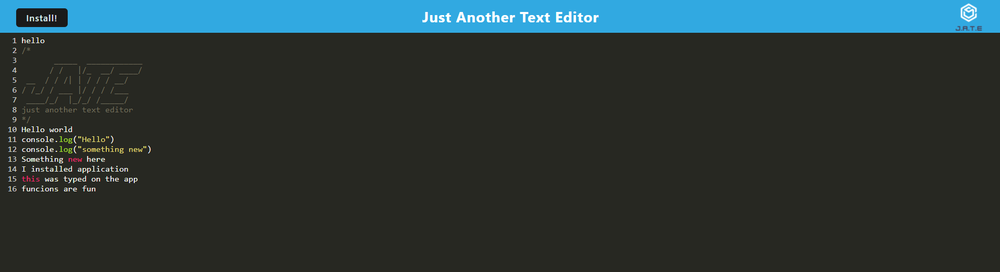

# PWA-Text-Editor

## Description
A simple text editor that allows users to enter text and have it saved automatically.  This is a progressive web app that can be installed on a users desktop.  This app uses a service worker and manifest.

## Table of Contents
- [PWA-Text-Editor](#pwa-text-editor)
  - [Description](#description)
  - [Table of Contents](#table-of-contents)
  - [Installation](#installation)
  - [Usage](#usage)
  - [Licence](#licence)
  - [Contributing](#contributing)
  - [Tests](#tests)
  - [Questions](#questions)
  - [Screenshot](#screenshot)
  - [Link to Github repository](#link-to-github-repository)
  - [Link to Deployed Website](#link-to-deployed-website)

## Installation
Download source code.  Navigate to folder and type npm install.
## Usage
Navigate to the webpage. Type in any text you want.  As soon as the browser loses focus the text will automatically save to IndexDB and localStorage.
## Licence
This project uses the [MIT](https://opensource.org/license/mit/) license.

## Contributing
If you would like to contribute to this project email me at the address below.
## Tests
None at this time.
## Questions
If you have any questions you can contact me at [michaeloc@verizon.net](michaeloc@verizon.net)  
Visit me at [Github](https://github.com/michaeloc1)
## Screenshot

## Link to Github repository
[Link](https://github.com/michaeloc1/PWA-Text-Editor) to Github repository.
## Link to Deployed Website
[Link](https://cryptic-waters-32557.herokuapp.com/) to deployed website.
